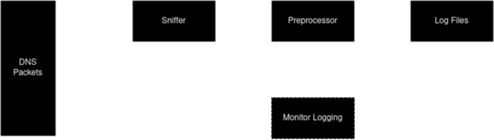

<h1 align="center">

Gosnifp - DNS Packet Sniffer
</h1>

- [About](#about)
- [Diagram](#diagram)
- [FAQ](#faq)

### Languages

- [English](./ENGLISH.md)
- [Portugues](./README.md)

## About

Gosnifp is a network sniffer focused on DNS communications that seeks to analyze and process the data collected, as well as transform it into Passive DNS.

## Diagram

## FAQ

### What is passive DNS?

Passive DNS is the act of collecting and storing DNS communication for future analysis, i.e. it consists of saving DNS request and response data.

### What is a Sniffer?

A sniffer is a program or piece of hardware that intercepts, visualizes and records network traffic data.

### Can I contribute to the project?

Qualquer contribuíção é aceita e bem vinda, o projeto inicialmente é algo publico e serve como base para estudos de rede, porém pode ser utilizado para casos reais.