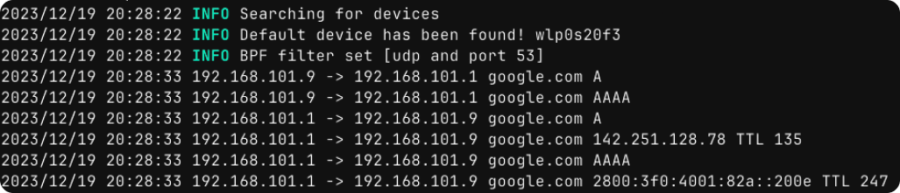

<h1 align="center">

    
Gosnifp


</h1>

<h4 align="center">

[Português](./README.md)

[English](./ENGLISH.md)

</h4>

Um sniffer de rede focado em comunicações DNS 




## Instalação

Caso queira todos os arquivos do projeto, certifique-se de que tenha o `Go` instalado e simplesmente `clone` o projeto.

```bash
git clone https://github.com/0x000b/gosnifp.git
cd gosnifp/
```
Na pasta, `digite`:
```bash
go build cmd/gosnifp/main.go
```
Obtido arquivo binário, apenas use `sudo` para permitir que o sniffer leia sua interface:
```bash
sudo ./gosnifp [INTERFACE]
```

## Diagrama

O diagrama busca representar o funcionamento básico do sniffer. Os pacotes DNS recebidos passam por dois processos principais: Sniffer e Preprocessor. O `Sniffer` é de fato a parte do software que captura os pacotes de forma ativa na rede e os envia para processamento. O `Preprocessor` é o responsável por capturar os dados importantes do pacote, criando um objeto referente ao pacote e enviando-o para os monitores (`Monitor Logging`) e loggers que criarão os arquivos de `Log`.


## FAQ 

<details>
<summary>
     O que é DNS Passivo?
</summary>

<p>
DNS Passivo é o ato de coletar e armazenar a comunicação DNS para futuras análises, ou seja, consiste em salvar os dados de requisição e resposta do DNS.
</p>
</details>


<details>
<summary>
    O que é um Sniffer?
</summary>

<p>
Sniffer é um programa ou hardware que intercepta, visualiza e registra os dados de um tráfego de rede.
</p>
</details>

<details>
<summary>
     Posso contribuir com o projeto?
</summary>

<p>
Qualquer contribuíção é aceita e bem vinda, o projeto inicialmente é algo publico e serve como base para estudos de rede, porém pode ser utilizado para casos reais.
</p>
</details>